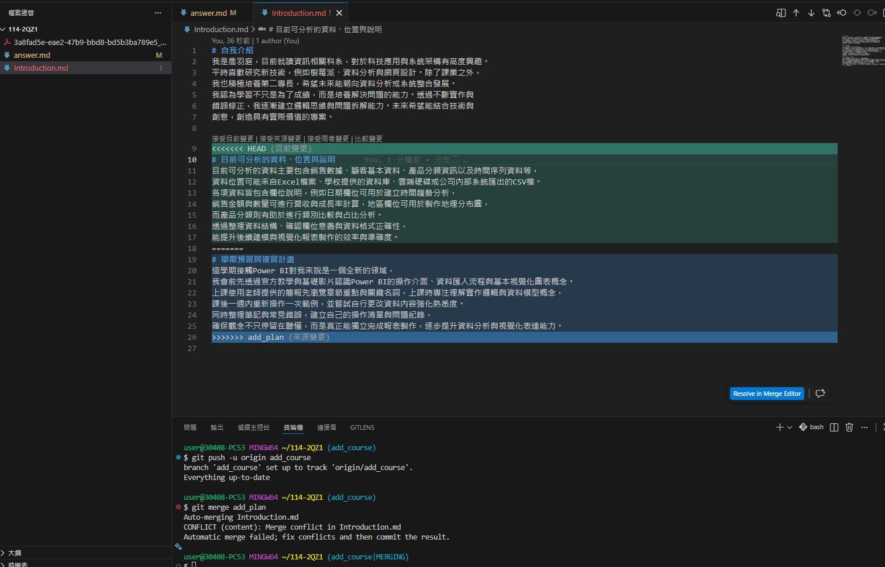

# 第1次隨堂題目-隨堂-QZ1
>
>學號：112111108
<br />
>姓名：詹羽庭
>

本份文件包含以下主題：(至少需下面兩項，若是有多者可以自行新增)
- [x] 說明內容

## 說明程式與內容

1. 

Ans: 
### 任務一：
1. 建立一個新的 Git 專案（或 Repository）。✅
fork老師的倉庫直接在裡面進行操作

2. 在 main 分支建立一個名為 Introduction.md 的檔案。 ✅
```bash
touch Introduction.md
```

3. 檔案內撰寫約 200 字 的個人自我介紹。 ✅

4. 將檔案 Commit 並 Push 到遠端數據庫（如 GitHub/GitLab）。 ✅
```bash
git add Introduction.md
git commit -m "任務一"
git push origin main
```

### 任務二： 從 main 分支分別切出兩條新分支，並完成以下修改：
1. 分支 add_plan ： 在 Introduction.md 結尾處新增：學期預習與複習計畫（如何達到學期成績 60 分以上），內容需達 200 字。 
完成後 Commit 並 Push 到遠端。✅

(1)建立新分支(add_plan)✅
```bash
git checkout -b add_plan
```

(2)在結尾處撰寫學期預習與複習計畫(200字)✅

(3)將檔案 Commit 並 Push 到遠端✅
```bash
git add Introduction.md
git commit -m "分支一"
git push -u origin add_plan
```

2. 分支 add_course ： 回到 main 後切換至此分支。 在 Introduction.md 結尾處（同樣的位置）新增：目前可分析的資料、位置與說明，內容需達 200 字。 完成後 Commit 並 Push 到遠端。 ✅

(1)回到main✅
```bash
git checkout main
```

(2)建立新分支(add_course)
```bash
git checkout -b add_course
```

(3)在結尾處撰寫目前可分析的資料、位置與說明(200字)✅

(4)將檔案 Commit 並 Push 到遠端✅
```bash
git add Introduction.md
git commit -m "分支二"
git push -u origin add_course
```

### 任務三：
1. 回到 main 分支。✅
```bash
git checkout main
```

2. 依序合併 add_plan 與 add_course 。✅
```bash
git merge add_plan
git merge add_course
```

3. 觀察會發生什麼事？ 請產生上述相對應檔案後，截圖，並完成 answer.md檔案後，並傳成PDF，再推上個 人github ( main 分支)✅

